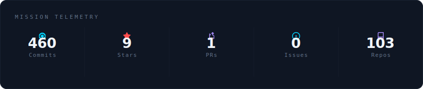

  

 

  

 

  

 

  

 

<strong>About Dahmer</strong>

 

Software Developer with 5+ years in PHP/Laravel, shifting focus to Offensive Security and Red Teaming.
Founder of DahmerLabs, providing specialized software consulting and security solutions.
Master's student in Systems Analysis & Development.

**Current Status:** Founder at **DahmerLabs** ? Brazil

 

  
  
  

